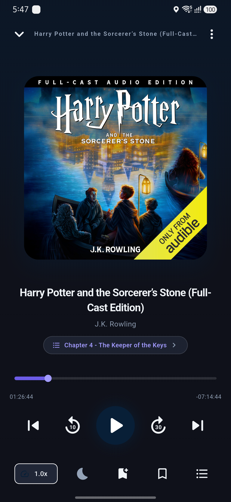

<div align="center">

  # StoryShelf

  **Modern, Offline-First M4B Audiobook Player for Mobile**

  [](https://flutter.dev)
  [](https://dart.dev)
  [](https://developer.android.com)
  [](https://riverpod.dev)
  [](https://hivedb.dev)
  [](LICENSE)

  <br/>

  
  &nbsp;&nbsp;&nbsp;
  
  &nbsp;&nbsp;&nbsp;
  

</div>

<br/>

---

## Key Features

### 📖 M4B Chapter Engine
- Direct binary parsing of Nero `chpl` atoms and QuickTime chapter text tracks (`trak -> mdia -> minf -> stbl`).
- Smart fallback division generating 30-minute chapter markers for unindexed files.
- Automated publisher marker sanitization converting raw tags into clean chapter labels.

### ⚡ Sub-50ms Two-Pass Scanner
- **Pass 1 (Instant)**: Fast MediaStore query renders the library dashboard in under 50ms on launch.
- **Pass 2 (Background Isolate)**: Binary atom decoding runs asynchronously in `Isolate.run()` worker threads, keeping UI frame rates locked at 60/120 FPS.

### 🎯 Strict File Filtering
- Targets `.m4b` files and `.m4a` files strictly within `/Audiobooks/` and `/Download/Audiobooks/` directories.
- Ignores general music libraries, voice memos, and system audio.

### 🎨 Dynamic Cover Palette & Glassmorphic UI
- Real-time color extraction from book artwork using `palette_generator` for dynamic background gradients.
- Time-based greeting header, Continue Listening hero card with circular progress ring, and custom page transitions (`SmoothPageRoute`).

### 📱 Background Playback & Storage
- Native Android lock screen controls and notification interface powered by `audio_service` and `just_audio`.
- Position tracking, custom playback speeds (0.5x – 3.0x), end-of-chapter sleep timers, and bookmarks stored locally in Hive.

---

## Technical Stack

| Component | Library / API | Function |
|---|---|---|
| **UI Framework** | Flutter | Cross-platform client application |
| **State Management** | `flutter_riverpod` | Reactive state management & dependency injection |
| **Storage & Database** | `hive` / `hive_flutter` | Lightweight key-value database for state persistence |
| **Audio Engine** | `audio_service` + `just_audio` | Native background audio handler & notification service |
| **Native Bridge** | Kotlin MethodChannel | Direct Android MediaStore & filesystem scanner |
| **Palette Generator** | `palette_generator` | Dynamic accent color extraction from cover art |

---

## Directory Structure

```
story_shelf/
├── android/              # Kotlin MainActivity & MediaStore MethodChannel
├── assets/               # Screenshots, app icons, and branding assets
├── lib/
│   ├── core/
│   │   ├── database/     # Hive database initializers & playback schema
│   │   ├── models/       # Book, Chapter, PlaybackState, AppSettings
│   │   ├── native_bridge/# MediaStoreService MethodChannel wrapper
│   │   ├── services/     # AudiobookAudioHandler background service
│   │   ├── theme/        # AppTheme dark mode design system & tokens
│   │   └── utils/        # M4bParser, TimeFormatter, SmoothPageRoute
│   └── features/
│       ├── bookmarks/    # Bookmarks sheet & provider state
│       ├── chapters/     # Modal M4B chapter picker
│       ├── library/      # Home dashboard, BookCard, ContinueListeningCard
│       ├── player/       # PlayerScreen, MiniPlayer, ScrubberBar, Speed & Sleep dialogs
│       ├── search/       # Real-time search screen
│       └── settings/     # App settings & default playback configuration
└── test/                 # M4B parser unit tests & widget tests
```

---

## Quick Start

### Prerequisites
- [Flutter SDK](https://docs.flutter.dev/get-started/install) (`>=3.3.0`)
- Android SDK API level 24+ (Android 7.0+)

### Setup Instructions

1. **Clone the repository**:
   ```bash
   git clone git@github.com:hamzaali265/story_shelf.git
   cd story_shelf
   ```

2. **Install dependencies**:
   ```bash
   flutter pub get
   ```

3. **Run on a connected Android device**:
   ```bash
   flutter run
   ```

4. **Run test suite**:
   ```bash
   flutter test
   ```

---

## Releases & Downloads

Pre-compiled Android APK binaries and release tags are available under [Releases](https://github.com/hamzaali265/story_shelf/releases/tag/v1.0.0).

- **Latest Version**: [`v1.0.0`](https://github.com/hamzaali265/story_shelf/releases/tag/v1.0.0)
- **Target**: Android 7.0+ (API 24+)

---

## License

Distributed under the [MIT License](LICENSE).
