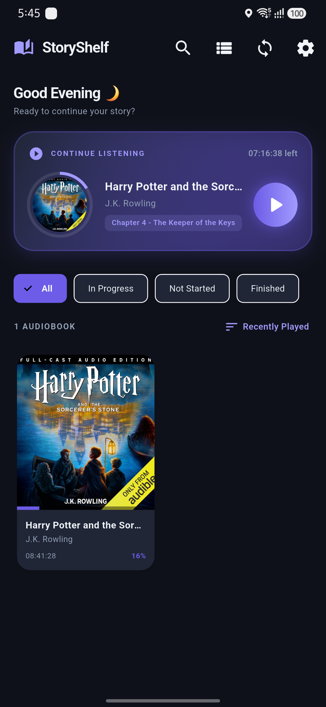
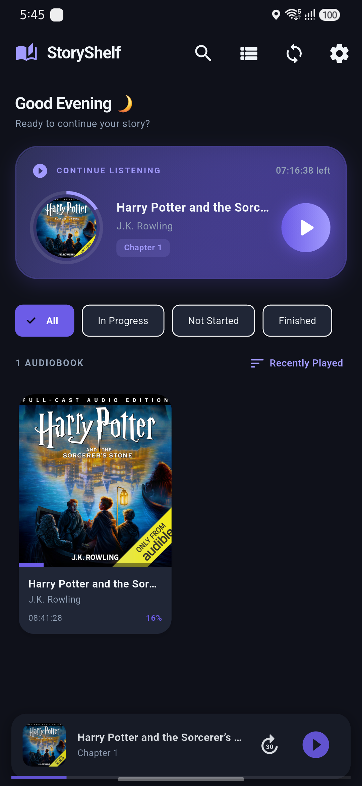

<div align="center">

  # 📚 StoryShelf

  **The Modern, Offline-First M4B Audiobook Player for Mobile**

  [](https://flutter.dev)
  [](https://dart.dev)
  [](https://developer.android.com)
  [](https://riverpod.dev)
  [](https://hivedb.dev)
  [](LICENSE)

  <p align="center">
    A beautiful, high-performance audiobook player built with Flutter. Designed for audiophiles who love offline M4B audiobooks with embedded chapter markers, instant playback, dynamic cover art gradients, and zero UI stuttering.
  </p>

</div>

---

## ✨ Features

- ⚡ **Instant Playback (<50ms)**: Sub-50ms startup latency when resuming audiobooks using two-pass asynchronous enrichment.
- 📖 **Embedded M4B Chapter Parser**: Reads Nero `chpl` atoms, QuickTime `stbl` text tracks, and intelligent 30-minute fallback auto-divisions.
- 🎯 **Strict Audiobook Discovery**: Filters device storage to discover `.m4b` files and `/Audiobooks/` folders while excluding music and ringtones.
- 🎨 **Dynamic Glassmorphic UI**: Extracts dynamic color palettes from book artwork for adaptive background gradients and shadow glows.
- 🧵 **Multi-Threaded Isolate Processing**: Offloads heavy binary atom parsing to background `Isolate.run()` worker isolates, maintaining a locked 60/120 FPS UI.
- 📱 **Background Audio & Media Controls**: Integrated with native Android lock screen notifications and media controls via `audio_service`.
- 💤 **Sleep Timers & Speed Control**: Custom speed adjustments (0.5x to 3.0x), countdown timers, and end-of-chapter sleep triggers.
- 🔖 **Bookmarks & Resume Progress**: Persistent position tracking across all books using Hive lightweight key-value database.
- 🏷️ **Smart Chapter Sanitization**: Automatically sanitizes raw publisher opening credits and intro markers into clean, readable chapter labels.

---

## 🛠️ Architecture & Tech Stack

```
lib/
├── core/
│   ├── database/         # Hive database initialization & persistent state schema
│   ├── models/           # Book, Chapter, PlaybackState, AppSettings, Bookmark
│   ├── native_bridge/    # Android MediaStore MethodChannel bridge
│   ├── services/         # AudiobookAudioHandler extending AudioHandler
│   ├── theme/            # AppTheme curated dark mode design system & tokens
│   └── utils/            # M4bParser (binary atom parser), TimeFormatter, PageTransitions
└── features/
    ├── bookmarks/        # Bookmark manager dialogs & Riverpod state providers
    ├── chapters/         # Modal chapter picker sheet
    ├── library/          # LibraryScreen, BookCard, ContinueListeningCard, ShimmerSkeleton
    ├── player/           # PlayerScreen, MiniPlayer, ScrubberBar, Speed & Sleep dialogs
    ├── search/           # Real-time instant library search screen
    └── settings/         # App settings screen & speed defaults
```

| Component | Technology | Purpose |
|---|---|---|
| **Framework** | Flutter (Dart) | Cross-platform UI engine |
| **State Management** | Flutter Riverpod | Reactive state management & provider dependency injection |
| **Local Storage** | Hive | High-speed NoSQL database for bookmarks, settings & playback state |
| **Audio Engine** | `audio_service` + `just_audio` | Native background audio playback & lock screen integration |
| **Color Extraction** | `palette_generator` | Dynamic accent color palette generation from cover artwork |
| **Native Bridge** | Kotlin MethodChannel | Direct Android MediaStore & storage filesystem queries |

---

## 🚀 Getting Started

### Prerequisites

- [Flutter SDK](https://docs.flutter.dev/get-started/install) (`>=3.3.0`)
- Android SDK (`API level 24+` / Android 7.0+)
- JDK 17+

### Installation & Running

1. **Clone the Repository**:
   ```bash
   git clone git@github.com:hamzaali265/story_shelf.git
   cd story_shelf
   ```

2. **Install Dependencies**:
   ```bash
   flutter pub get
   ```

3. **Run on Connected Device**:
   ```bash
   flutter run
   ```

4. **Run Unit Tests**:
   ```bash
   flutter test
   ```

---

## 📱 Screenshots & UI Highlights

<div align="center">
  
  &nbsp;&nbsp;&nbsp;&nbsp;
  
</div>

<br/>

| Home Library Dashboard | Dynamic Full-Screen Player |
|:---:|:---:|
| Time-based greeting banner, Continue Listening hero card with circular progress ring, pill filters, grid/list view | Dynamic gradient backdrop, scrubber bar, speed selector, end-of-chapter sleep timer & chapter picker |

---

## 🤝 Contributing

Contributions are welcome! If you'd like to improve chapter parsing, add iOS-specific media pickers, or enhance UI animations:

1. Fork the Project
2. Create your Feature Branch (`git checkout -b feature/AmazingFeature`)
3. Commit your Changes (`git commit -m 'feat: add amazing feature'`)
4. Push to the Branch (`git checkout -b feature/AmazingFeature`)
5. Open a Pull Request

---

## 📄 License

Distributed under the MIT License. See `LICENSE` for more information.

---

<div align="center">
  Crafted with ❤️ for audiobook lovers worldwide.
</div>
